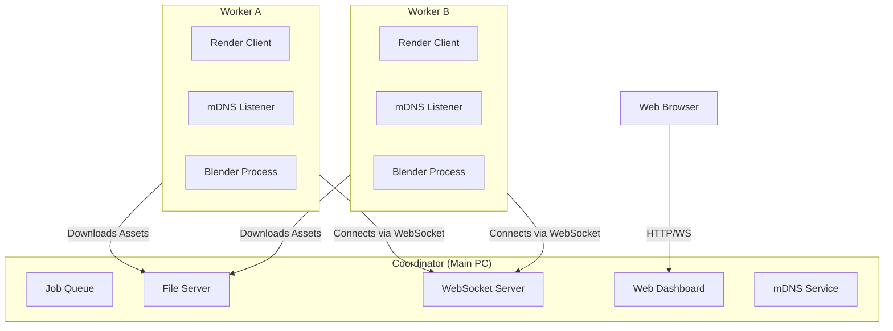

# Architecture Overview

WeRender allows any computer on a local network to contribute to rendering a Blender project. It uses a **Hub-and-Spoke** architecture where one machine acts as the **Coordinator** and others act as **Workers**.

## High-Level Components

## Core Concepts

### 1. Zero-Config Discovery (mDNS)

- The **Coordinator** broadcasts its presence on the local network using mDNS (Zeroconf). service name: `_werender._tcp.local.`.
- **Workers** listen for this service. When detected, they automatically resolve the IP and port and initiate a connection.
- No manual IP entry is required.

### 2. Communication Layer

- **WebSocket Protocol**: Used for real-time state management.
  - Workers send heartbeat signals (resource usage, status).
  - Coordinator pushes job assignments and cancellation requests.
  - Real-time logs are streamed back to the Coordinator.
- **HTTP API**: Used by the Web Dashboard to query state and control jobs.

### 3. Asset Distribution

- When a job starts, the Coordinator packs the Blender project (using Blender's "Pack Resources") and serves it via a temporary HTTP file server.
- Workers download this payload *once* per job ID (cached locally in a temporary directory) to minimize network traffic.

### 4. Job Scheduling

- The Coordinator maintains a queue of frames to be rendered.
- **Chunking**: Frames are assigned in chunks (default: 1 frame) to ensure fair distribution and granulated fault tolerance.
- **Failover**: If a Worker disconnects or times out, its assigned frames are returned to the queue to be picked up by another Worker.

## Data Flow: Rendering a Frame

1. **Job Submission**: User submits `scene.blend` (Frames 1-100) via CLI or Dashboard.
2. **Packing**: Coordinator packs assets into a single ready-to-render file.
3. **Announcement**: Coordinator signals "New Job Available" to connected Workers.
4. **Assignment**: Worker A requests a task. Coordinator assigns Frame 1.
5. **Downloading**: Worker A downloads the packed `.blend` file (if not already cached).
6. **Rendering**: Worker A launches a background Blender process to render Frame 1 to a temp file.
7. **Result Upload**: Worker A reads the rendered image and sends it back to the Coordinator (or saves to a shared network path if configured).
8. **Completion**: Worker A reports "Task Complete" and requests the next frame.
